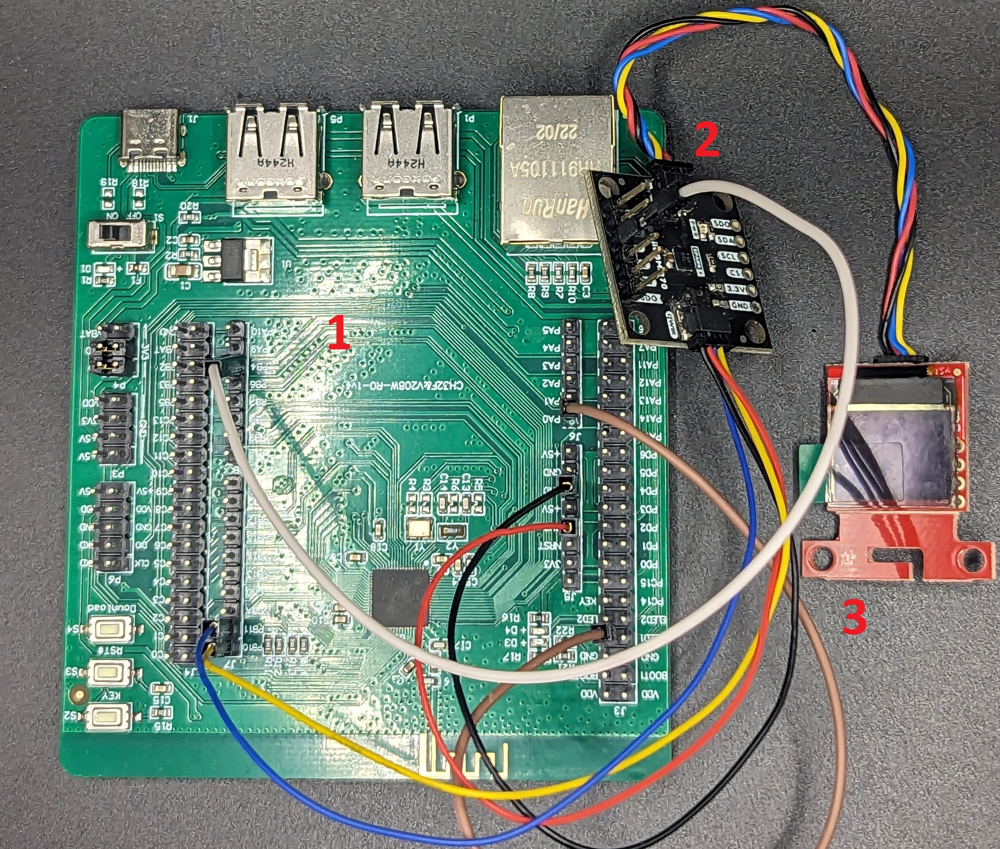

# RT Thread Pedometer

This is my entry for the RT-Thread OS contest. It is a low-cost, low-power pedometer (shown in the image below). It is meant to track physical activity (parameters like steps, significant physical activity etc.)

The prototype is built around the [CH32V208 dev board](https://github.com/openwch/ch32v20x/tree/main). 

The image consists of the following components namely:

1. Dev Board
2. BMI270 IMU Dev Board
3. OLED Display

The pedometer makes use of the:

1. BLE capability on the CH32V208 chipset
2. Interfaces the BMI270 IMU
3. OLED display

The following items are complete:

1. BMI270 accelerometer interface
2. OLED display interface

The following items are pending:

BLE stack implementation using RT-Thread. 
PCB design
